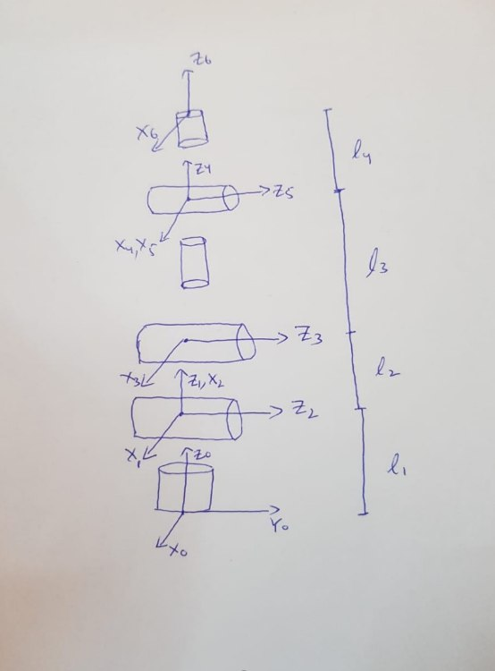
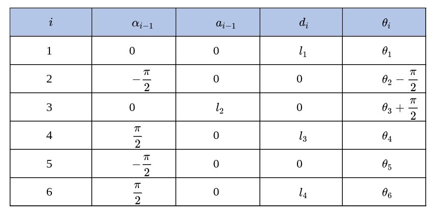
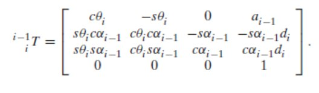

# Inverse-Kinematics-of-6-DOF-Manipulator-with-a-spherical-Wrist

## 6‑DOF Manipulator IK (DH‑Based) + Arduino Control

This repository contains:
- A MATLAB inverse kinematics (IK) implementation using Denavit–Hartenberg (DH) parameters
- An Arduino Mega sketch (`IK_function.ino`) that runs the same IK on a real 6‑DOF manipulator driven by stepper motors

## Quick Summary
- IK uses DH parameters and closed‑form trigonometry (position + orientation)
- Orientation uses yaw/pitch/roll with `R60 = Rz * Ry * Rx`
- Arduino sketch takes serial input (x, y, z, yaw, pitch, roll), computes IK, and moves the arm

## Theory
The Frame assignment for the joints of six DOF robotic arm is as follows:

The frames from F0 to F6 are all assigned to the manipulator joints. The base joint is given the reference frame X0, Y0, Z0, and the frame for joint 1 is translated upwards to meet the joint2 to include the length of the link1. Similarly, joint 2 and 3 are assigned their respective frames and joint 4 frame is shifted up to meet joint 5 to include the length of link 3. Finally, joint 5 and 6 are assigned their respective frames.

After frame assignment the DH parameters are determined using the convention. The DH table is as follows:

The Transformation matrix from one frame to the next i.e., Fi to Fi+1 is given by the following matrix: 

Now we must determine each frame transformation and then transform the end-effector frame to the reference frame i.e., the base frame. The transformation of end-effector frame to the base frame is given as: 

$$ _6^0T =\quad_1^0T\quad_2^1T\quad_3^2T\quad_4^3T\quad_5^4T\quad_6^5T$$

The derivation of these matrices is performed on MATLAB using symbolic variables. The third column of the transformation matrix gives the positions in the x, y, and z coordinates for a given set of joint space inputs. Following is the forward kinematics of the manipulator: 

$$ X = cos(\theta_1) \times (l_2 sin(\theta_2) + l_3 sin(\theta_{23}))$$
$$ Y = sin(\theta_1) \times (l_2 sin(\theta_2) + l_3 sin(\theta_{23}))$$
$$ Z = l_1 + l_2 cos(\theta_2) + l_3 sin(\theta_{23})$$

The inverse kinematics solution was found by squaring and adding the three position terms as follows:

$$ X^2 + Y^2 + (Z - l_1)^2 = l_2^2 + l_3^2 + 2l_2l_3 cos(\theta_3)$$

The cosine of joint angle three term can be separated and determined as every other term in equation2 is known, followed by determining sine of joint angle three followed by joint angle 3 using arctan of sine and cosine terms:

$$ cos(\theta_3) = \frac{X^2 + Y^2 + (Z - l_1)^2 - l_2^2 - l_3^2}{2l_2l_3} $$
$$ sin(\theta_3) = \sqrt{1 - cos(\theta_3)^2} $$
$$ \theta_3 = Atan2(sin(\theta_3), cos(\theta_3)) $$

Similarly, joint angle 1 is determined using:

$$ \theta_1 = Atan2(y_w, x_w) $$

Where yw and xw are wrist positions determined using the desired goal position and the rotation matrix of the final desired orientation rotated with respect to base frame orientation:

$$ R_6^0 = R_x R_y R_z $$

This equation is an initial condition to the inverse kinematics problem, and it is crucial to determining the wrist position given a desired end effector position. 

Similarly joint angle 2 is determined using algebraic and trigonometric manipulations in equation set 1 as joint angle 2 is known and equation set 1 is only dependent on 2 unknowns one of which i.e., theta3 is already determined. 

The joint angles 1,2, and 3 solve the inverse positioning problem. The inverse orientation problem is solved using the transformations T30 and T60 to determine the matrix  T36: 

$$ _3^6T = \frac{T_6^0}{T_3^0} $$

Then the symbolic terms for angles 4,5, and 6 are compared to the matrix computed in equation 6. This is the inverse orientation problem which defines the orientation of the end-effector at the goal point. However, it is important to initially define the rotation of goal frame with respect to base frame using equation 5. It is also crucial to determine wrist position first using: 

$$ P_w = _6^0 P - l_4 _6^0 Z $$

Where Pw is the wrist position, $_6^0P$ and $l_4_6^0Z$ are goal position and offset from end-effector to wrist point respectively

## Repo Structure
- `matlab/` – MATLAB implementation and tests
- `arduino/IK_function/` – Arduino Mega sketch

## Kinematics Overview
**Link lengths (mm)**
- MATLAB: `l1=112`, `l2=265`, `l3=210`, `l4=130`, `lx=50`
- Arduino: `l1=114`, `l2=265`, `l3=218`, `l4=130`, `lx=20`

**Orientation**
- Yaw, pitch, roll (degrees in Arduino input)
- Rotation order: `Rz * Ry * Rx`

**Wrist center**

Pw = Pg - l4 * R60(:,3)

## MATLAB: How to Run
1. Open `matlab/Kinematics.m`
1. Set goal position and orientation at the top of the script
1. Run the script
1. It prints desired vs. computed positions and orientation

## Arduino: How to Run
**Hardware**
- Arduino Mega
- 6 stepper drivers
- 1 servo (gripper)

**Pins**
- Joint 1: dir `48`, step `49`
- Joint 2: dir `27`, step `26`
- Joint 3: dir `53`, step `52`
- Joint 4: dir `35`, step `34`
- Joint 5: dir `39`, step `38`
- Joint 6: dir `43`, step `42`
- Servo: pin `11`

**Steps**
1. Open `arduino/IK_function.ino` in Arduino IDE
2. Upload to Arduino Mega
3. Open Serial Monitor at `9600`
4. Enter:
   - `x`, `y`, `z` (mm)
   - `yaw`, `pitch`, `roll` (degrees)

## Known Assumptions / Caveats
- `yg` offset compensation is applied in Arduino:
  - if `yg < 0`: `yg = yg - 90`
  - else: `yg = yg + 50`
- Gear ratios are applied to convert angles to motor steps:
  - `g1=40, g2=50, g3=50, g4=300, g5=9, g6=25`
- MATLAB and Arduino link lengths currently differ; ensure they match if you want consistent results.

## Credits
Designed and implemented by Fawad Mehboob

